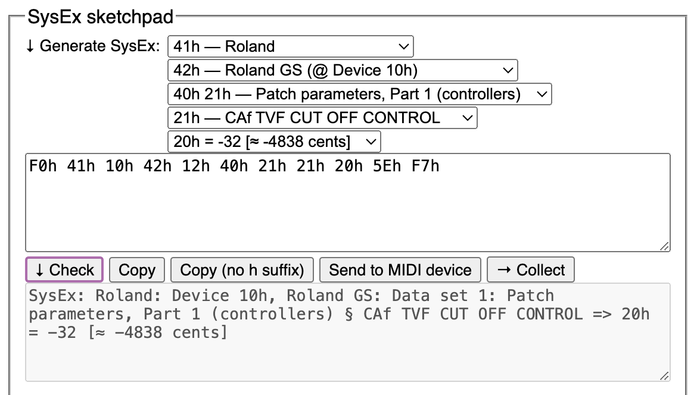
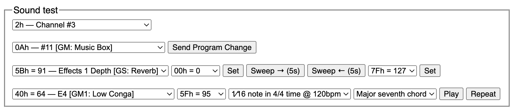
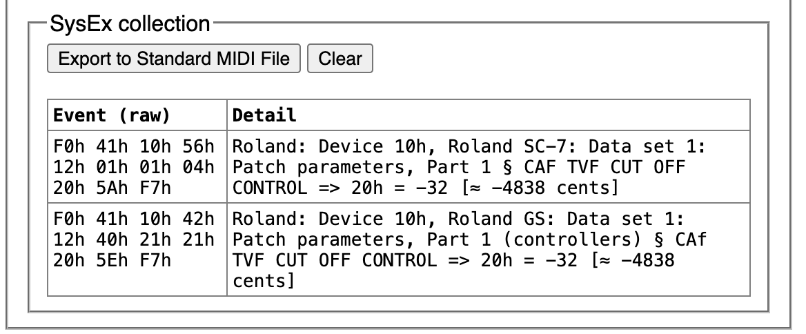
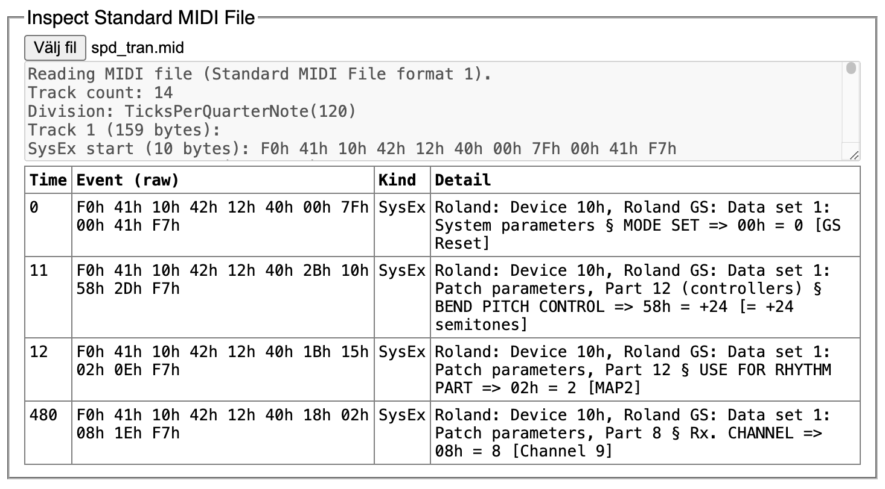

# SoundPalette: MIDI SysEx Generator

This is the source code for SoundPalette, a tool for editing MIDI System Exclusive (SysEx) messages for the Roland SC-55 (Roland GS) and Roland SC-7 tone generators. SysExes can be used to customise effects and alter sounds.

※ SoundPalette is not a product of, affiliated with or endorsed by Roland Corporation.

Currently supports (as of v1.0.0):

* All Roland SC-7 exclusive messages.
* Most Roland GS messages supported by Roland SC-55 and Roland SC-55mkII. (Notable absences: drum map editing and voice/partial reserves.)

Future plans:

* More standard MIDI/General MIDI support.
* More Roland GS device support.
* Yamaha XG support.

Here are some things SoundPalette can do:

**Use it directly in your browser**. No download or install necessary. Try it out at <https://hikari.noyu.me/etc/SoundPalette/>! You can also download a release if you want, but it's a bit tricky to use as you may have to run a local web server.



**Inspect a SysEx**. Paste or type in a SysEx message to find out what it does.

**Create a SysEx**. Use drop-down menus to select which parameter you want to set, and what value to set it to. SoundPalette will generate a SysEx.

**Copy a SysEx**. Copy a SysEx to clipboard for pasting into a MIDI application.

**Send SysEx over MIDI**. Click a button to send a SysEx directly to a connected MIDI device. (Requires Chrome or Firefox.)



**Test effects**. SoundPalette can send simple note and control change data directly to a connected MIDI device, so you can easily test how a SysEx affects the sound. (Requires Chrome or Firefox.)



**Collect SysExes**. Build up a collection of different SysEx messages.

**Export a MIDI file**. Export the collection to a MIDI file, for importing into a MIDI application.



**Inspect a MIDI file**. Load a MIDI file to find out what SysEx messages it contains, and what they do.

# Developer stuff

Standard Rust/Cargo project, no dependencies. `cargo doc`, `cargo fmt`, `cargo test` and `cargo clippy` are all tools you should use.

If you want to reuse the tables of SysEx data under a different licence for your own MIDI-related OSS project, or would like help adapting or testing this, please get in contact with me at my git email address.

## Building the CLI tool

This tool exists just for testing right now and doesn't have most of the functionality of the web app.

`cargo run` will build and run it. You can pass arguments after a `--`, e.g. `cargo run -- in.mid -o out.mid`.

## Building the web app

```sh
cargo build --target wasm32-unknown-unknown --lib
```

Then run a local web server by your favourite method, e.g.:

```sh
cd htdocs && php -S localhost:8000
```

Note that this relies on symlinks for the `.wasm` and `.d` files. You can use directly copy those files from `target/wasm32-unknown-unknown/debug/` to `htdocs/` instead, if needed.

## Testing

```shell
cargo test
```

The tests are run as native code, not as WebAssembly.
